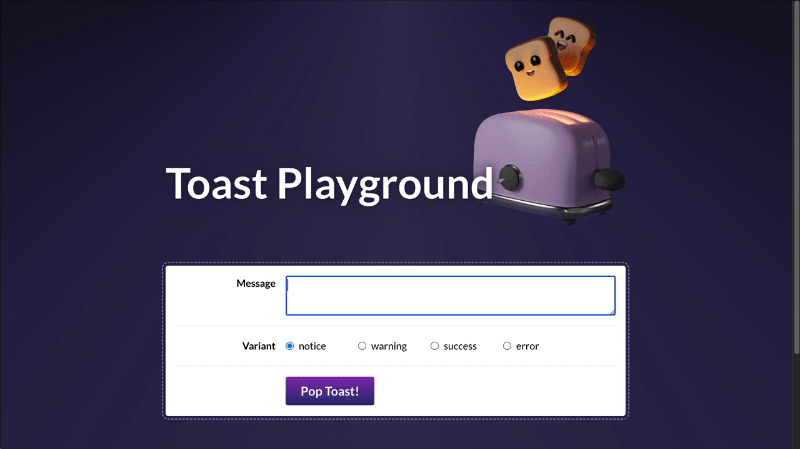

# React Toast Component

This project focuses on building a customizable <Toast> message component with React. The component allows users to create and manage toast notifications with different variants, including notice, warning, success, and error. It is designed to improve user interaction through exercises that focus on state management, UI customization, and accessibility.

## Features

- **Form Controls for Toast Messages**  
  The user can type a message and select a toast variant from a group of radio buttons. The controls are managed with React state to ensure dynamic updates.

- **Live-Editable Toast Preview**  
  A preview of the toast message is updated in real-time based on user input. This includes the message and variant styling, allowing users to see changes before the toast is created.

- **Toast Stacking**  
  Multiple toasts can be created and stacked on top of each other, appearing one after another. Each toast can be individually dismissed without affecting the others.

- **Toast Context**  
  The app is designed with scalability in mind, using the Context API to manage all toast-related state. This allows for easier state management and cleaner component structures.

- **Keyboard Accessibility**  
  The toast component supports keyboard interactions, including an "Escape" key handler to dismiss all toasts at once, enhancing accessibility for users who rely on keyboard navigation.

- **Custom Hooks**  
  The project includes a custom hook (`useEscapeKey`) to handle keydown events in React, making it reusable across different components.

## How to Run

1. Clone the repository
2. Run `npm install` to install dependencies
3. Navigate to the project directory with `cd project-toast-main`
4. Start the development server with `npm run dev`
5. Use the playground to create and manage toast notifications